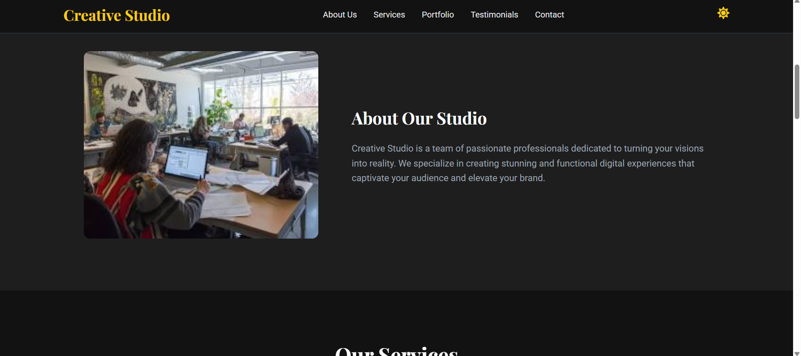

# Creative Studio Website

This is a fully responsive landing page for a fictional creative agency, built from scratch with React and Vite. The project features a modern design with a dark/light mode toggle and interactive components.

**Live Demo:** [Link to your deployed site will go here]

---

## Screenshot

### Screenshots

---

---

---

---

---

---

---

---

## Features

-   **Animated Hero Text:** A dynamic "typing and backspace" effect for the main heading.
-   **Interactive Modals:** Detailed pop-ups for both the Services and Portfolio sections.
-   **Dark/Light Mode Toggle:** A functional theme switcher with smooth transitions, saving user preference.
-   **Smooth Scrolling:** Navigational links and buttons scroll smoothly to the relevant sections.
-   **Responsive Design:** The layout is fully optimized for desktop, tablet, and mobile devices.

---

## Technologies Used

-   **React:** For building the user interface.
-   **Vite:** As the frontend build tool.
-   **CSS:** Custom styling with CSS variables for easy theming.
-   **React Icons:** For a library of high-quality icons.

---
